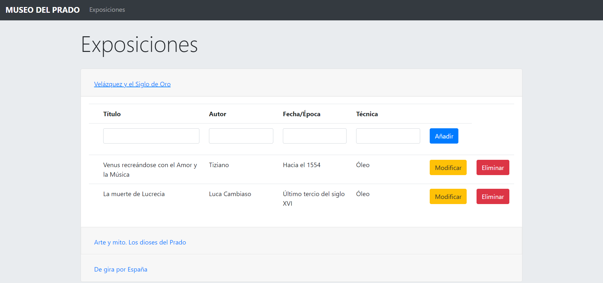
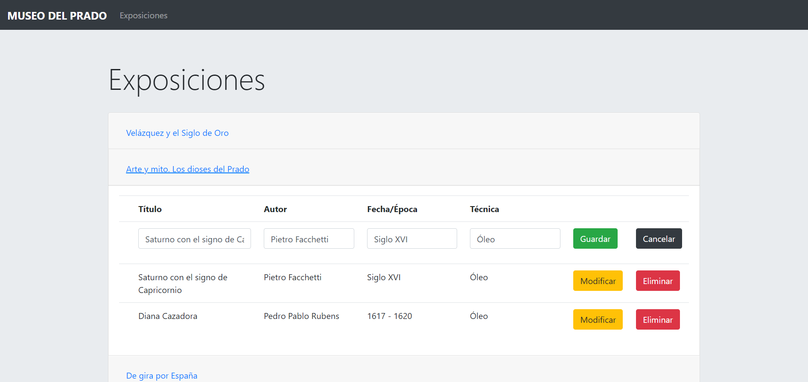

# Control de cuadros y exposiciones 2.0
Ejemplo de CRUD para la gestión de los cuadros en exposiciones de un museo

# *Novedades de la versión 2.0*
- La página principal solo muestra datos y da opción de iniciar sesión.
- Se ha añadido un login para que solo se puedan modificar datos de la página si eres administrador.
- Implementación de seguridad para no poder acceder al panel de administración sin iniciar sesión.
- Encriptación MD5 en la base de datos de las contraseñas para que nadie pueda obtenerlas.
- Solo se podrá registrar una cuenta desde el panel de administración, previo inicio de sesión.

# Descripción

En este CRUD podemos seleccionar las 3 exposiciones que hay en el museo añadir, editar, borrar y ver que cuadros hay en cada exposición.

<b>PINCHA</b> <a href="https://youtu.be/DpOQg2-JZYw">AQUÍ</a> <b> PARA VER EL VÍDEO EXPLICATIVO</b>

En esta imagen vemos como podemos editar los cuadros en la primera exposición. 

En esta podemos ver como no necesitamos especificar la exposición en la que queremos editar los cuadros, seleccionandola se guardará en esa misma automáticamente. 

En esta imagen vemos como podemos editar los administradores de la página. 

